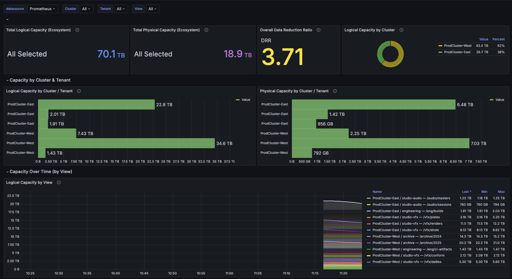

[](LICENSE)
[](https://grafana.com)
[](https://prometheus.io)
[](https://vastdata.com)
[](docker-compose.yml)

# VAST Ecosystem Capacity Dashboard

A Grafana dashboard for monitoring storage capacity across an entire VAST Data ecosystem — **multiple clusters, multiple tenants, multiple views** — from a single pane of glass.

Built for the scenario where a single user has access to several VAST clusters, belongs to different tenants in each, and needs to see their aggregate storage footprint alongside per-view breakdowns.

Note: Grafana 12 has a rendering incompatibility with schema version 39 dashboards. The importable JSON works on Grafana 10.x-11.x.



## What It Shows

| Row | Panels | Purpose |
|-----|--------|---------|
| **Ecosystem Totals** | Total Logical, Total Physical, DRR, Capacity by Cluster (donut) | Aggregate numbers across the entire selection |
| **Cluster & Tenant** | Logical by Cluster/Tenant (bar), Physical by Cluster/Tenant (bar) | Compare capacity distribution across organizational boundaries |
| **Time Series** | Logical by View, Physical by View | Capacity trends over time, each line labeled `cluster / tenant — /path` |
| **Detail Table** | Full breakdown table | Cluster, Tenant, View Path, Logical, Physical, DRR with sum footer |

### Cascading Dropdowns

Three multi-select dropdowns filter the entire dashboard:

**Cluster** > **Tenant** > **View**

Each dropdown scopes the next — selecting a cluster filters tenants to those in that cluster, selecting a tenant filters views to those in that tenant. Default is "All" at every level, showing the full ecosystem.

## How It Works

```
VAST Cluster A ──┐                          ┌── Grafana Dashboard
                 ├── Prometheus (scrapes) ──┤
VAST Cluster B ──┘                          └── Cascading filters
```

- **Prometheus** scrapes `/api/prometheusmetrics/views` from each VAST cluster, one job per (cluster, tenant) pair
- Each job uses `X-Tenant-Name` header + `basic_auth` to scope metrics to that tenant
- VAST returns `vast_view_logical_capacity` and `vast_view_physical_capacity` gauges with labels: `cluster`, `tenant_name`, `path`
- **Grafana** reads from Prometheus and uses `label_values()` to populate the cascading dropdowns

## Quick Start (Demo with Mock Data)

Try the dashboard instantly with simulated data (2 clusters, 4 tenants, 11 views):

```bash
git clone https://github.com/ssotoa70/vast-ecosystem-capacity-dashboard.git
cd vast-ecosystem-capacity-dashboard
docker compose up -d
```

Open http://localhost:3000/d/vast-ecosystem-capacity (login: `admin` / `admin`).

To stop: `docker compose down`

## Deploy to Your Environment

See the full **[Deployment Guide](docs/DEPLOYMENT.md)** for step-by-step instructions.

**TL;DR:**

1. Edit `prometheus.yml` — one scrape job per (cluster, tenant), change 5 fields per job:

   | Field | What to set |
   |-------|-------------|
   | `job_name` | Unique name, e.g. `prod-east-vfx` |
   | `targets` | VMS VIP + port, e.g. `['10.1.0.10:443']` |
   | `X-Tenant-Name` | Tenant name in VAST, e.g. `vfx` |
   | `username` | Tenant Admin username |
   | `password` | Tenant Admin password |

2. Start Prometheus: `prometheus --config.file=prometheus.yml`
3. Import `vast-tenant-capacity-dashboard.json` in Grafana
4. Select your Prometheus datasource and click Import

## Files

| File | Purpose |
|------|---------|
| `prometheus.yml` | Prometheus scrape config template (2 clusters, 5 tenants) |
| `vast-tenant-capacity-dashboard.json` | Importable Grafana dashboard JSON |
| `docker-compose.yml` | Demo stack: mock exporter + Prometheus + Grafana |
| `docs/DEPLOYMENT.md` | Full deployment and configuration guide |
| `mock/metrics.py` | Python mock exporter simulating VAST metrics |

## Prometheus Metrics

| Metric | Type | Labels | Description |
|--------|------|--------|-------------|
| `vast_view_logical_capacity` | gauge | `cluster`, `tenant_name`, `path` | Data written by clients (before reduction) |
| `vast_view_physical_capacity` | gauge | `cluster`, `tenant_name`, `path` | Storage consumed (after reduction) |

## Extending

- **Add a cluster**: Add scrape jobs in `prometheus.yml` — the `cluster` label auto-populates the dropdown
- **Add a tenant**: Copy a job block, change tenant name + credentials
- **Add quota metrics**: Duplicate jobs with `metrics_path: '/api/prometheusmetrics/quotas'`
- **Add performance metrics**: Use `/api/prometheusmetrics/views` (already scraped) — BW and IOPS metrics are included

## Requirements

- VAST Cluster 5.3+ (Tenant Admin metrics access)
- Prometheus 2.45+
- Grafana 10.x (tested on 10.4; uses dashboard schema version 39)
- Docker 20+ (only for the demo stack)

## License

[MIT](LICENSE)
